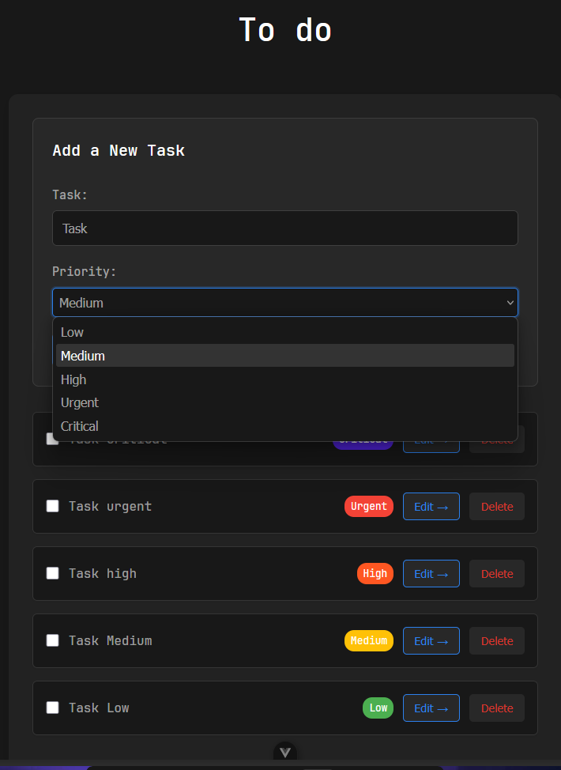
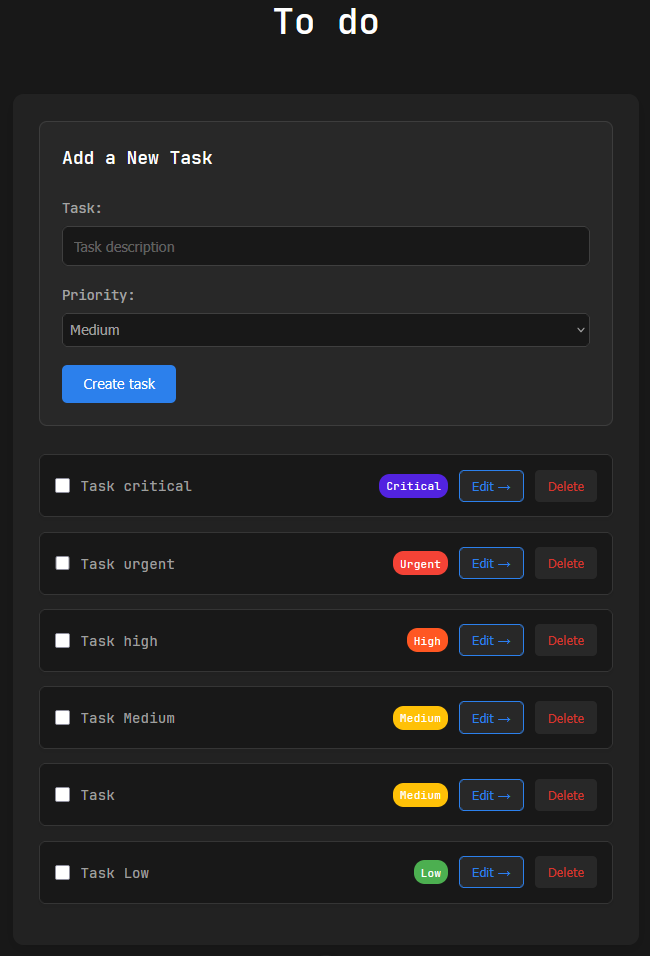
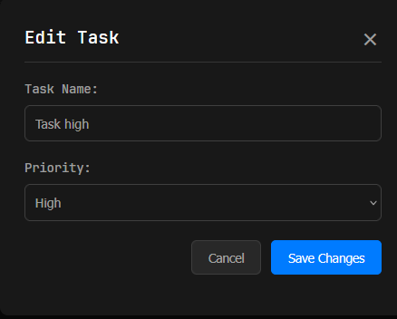

# 📝 Vue.js Todo App

> A modern, responsive todo application built with Vue 3, TypeScript, and Vite. Features priority-based task management with a clean dark theme interface.

[](https://vuejs.org/)
[](https://www.typescriptlang.org/)
[](https://vitejs.dev/)
[](https://pnpm.io/)

---

## 📸 Screenshots

<div align="center">
  <table>
    <tr>
      <td align="center">
        
        <br/>
        <strong>Empty State</strong>
      </td>
      <td align="center">
        
        <br/>
        <strong>Priority Selection</strong>
      </td>
    </tr>
    <tr>
      <td align="center">
        
        <br/>
        <strong>Task Management</strong>
      </td>
      <td align="center">
        
        <br/>
        <strong>Edit Task Modal</strong>
      </td>
    </tr>
  </table>
</div>

---

## ✨ Features

### 🎯 Core Features
- **📋 Task Management** - Create, edit, delete, and mark tasks as complete
- **🔥 Priority System** - 5-level priority system (Critical, Urgent, High, Medium, Low)
- **🎨 Priority-Based Sorting** - Tasks automatically sorted by priority and creation date
- **✅ Task Completion** - Toggle completion status with visual feedback
- **💾 Local Storage** - Persistent data storage in browser
- **📱 Responsive Design** - Works seamlessly on desktop and mobile devices

### 🚀 Advanced Features
- **🎭 Modal Interface** - Clean modal for task editing
- **⌨️ Keyboard Navigation** - Full keyboard accessibility support
- **🔍 Focus Management** - Proper focus handling for accessibility
- **📊 Color-Coded Priorities** - Visual priority indicators with distinct colors

### 🎨 Priority System
- **🔴 Critical** - Purple badge for highest priority tasks
- **🟠 Urgent** - Red badge for urgent tasks
- **🟡 High** - Orange badge for high priority tasks
- **🟢 Medium** - Yellow badge for medium priority tasks
- **🔵 Low** - Green badge for low priority tasks

---

## 🛠️ Tech Stack

### 🎨 Frontend
| Technology | Purpose |
|------------|---------|
| **Vue 3** | Progressive JavaScript framework with Composition API |
| **TypeScript** | Type-safe JavaScript development |
| **Vite** | Fast build tool and development server |
| **CSS3** | Modern styling with CSS custom properties |
| **HTML5** | Semantic markup and accessibility |

### 📦 Package Manager
| Technology | Purpose |
|------------|---------|
| **PNPM** | Fast, disk space efficient package manager |

### 🏗️ Architecture
- **Composition API** - Modern Vue 3 reactive composition
- **TypeScript Interfaces** - Type-safe data structures
- **Component-Based** - Modular and reusable components
- **Reactive State** - Vue's reactivity system for state management
- **Local Storage** - Client-side data persistence

---

## 🚀 Getting Started

### 📋 Prerequisites
- **Node.js** 
- **PNPM** (recommended) or npm/yarn
- Modern web browser with ES6+ support

### 🛠️ Installation

1. **Clone the repository**
   ```bash
   git clone https://github.com/kevinfjq/To-do-vue-gm.git
   cd To-do-vue-gm
   ```

2. **Install dependencies**
   ```bash
   # Using PNPM (recommended)
   pnpm install
   
   # Or using npm
   npm install
   
   # Or using yarn
   yarn install
   ```

3. **Start development server**
   ```bash
   # Using PNPM
   pnpm dev
   
   # Or using npm
   npm run dev
   
   # Or using yarn
   yarn dev
   ```

4. **Open in browser**
   - Navigate to `http://localhost:5173`
   - The app will automatically reload when you make changes

### 📦 Build for Production

```bash
# Using PNPM
pnpm build

# Or using npm
npm run build

# Or using yarn
yarn build
```

### 🔍 Preview Production Build

```bash
# Using PNPM
pnpm preview

# Or using npm
npm run preview

# Or using yarn
yarn preview
```

---

## 📁 Project Structure

```
📦 vue-todo-app/
├── 📁 public/                    # Static assets
├── 📁 src/
│   ├── 📄 App.vue               # Main application component
│   ├── 📄 main.ts               # Application entry point
│   ├── 📁 assets/               # Styles and static assets
│   │   ├── 📄 base.css          # Base styles and CSS variables
│   │   ├── 📄 main.css          # Main application styles
│   │   └── 📄 logo.svg          # Vue logo
│   ├── 📁 components/           # Vue components
│   │   ├── 📄 TodoForm.vue      # Task creation form
│   │   ├── 📄 TodoItem.vue      # Individual task component
│   │   ├── 📄 TodoList.vue      # Task list container
│   │   └── 📄 EditTaskModal.vue # Task editing modal
│   └── 📁 utils/                # Utility functions and types
│       ├── 📄 priorities.ts     # Priority definitions
│       └── 📄 tasks.ts          # Task type definitions
├── 📄 index.html                # HTML template
├── 📄 package.json              # Dependencies and scripts
├── 📄 tsconfig.json             # TypeScript configuration
├── 📄 tsconfig.app.json         # App-specific TypeScript config
├── 📄 vite.config.ts            # Vite configuration
└── 📄 README.md                 # Project documentation
```

---

## How to Use

### ➕ Adding Tasks
1. **Enter task description** in the "Task" input field
2. **Select priority** from the dropdown (Critical, Urgent, High, Medium, Low)
3. **Click "Create task"** to add the task to your list

### ✏️ Editing Tasks
1. **Click "Edit →"** button on any task
2. **Modify** the task name and/or priority in the modal
3. **Click "Save Changes"** to update the task
4. **Use "Cancel"** to discard changes

### ✅ Managing Tasks
- **Toggle completion** by clicking the checkbox next to any task
- **Delete tasks** using the "Delete" button
- **Tasks are sorted** automatically by priority and creation date
- **Completed tasks** are visually distinguished with strikethrough text

### ⌨️ Keyboard Navigation
- **Tab/Shift+Tab** - Navigate between interactive elements
- **Enter** - Submit forms or activate buttons
- **Escape** - Close modal dialogs
- **Space** - Toggle checkboxes

---

## 🎨 Design Features

### 🌙 Dark Theme
- Elegant dark color scheme with high contrast
- CSS custom properties for consistent theming
- Smooth transitions between UI states
- Responsive design that works on all screen sizes

### 🎯 Priority-Based Organization
- Visual priority indicators with distinct colors
- Automatic sorting by priority level
- Clear visual hierarchy for task importance
- Intuitive color coding system

### ♿ Accessibility
- Semantic HTML structure
- Proper ARIA labels and roles
- Keyboard navigation support
- Focus management for modals
- High contrast colors for readability

---

## 🔧 Configuration

### 📱 Responsive Breakpoints
- **Mobile**: < 600px
- **Tablet**: 600px - 1024px
- **Desktop**: > 1024px


### 🔄 Auto-save
Tasks are automatically saved to localStorage whenever:
- A new task is created
- An existing task is modified
- A task is deleted or completed

